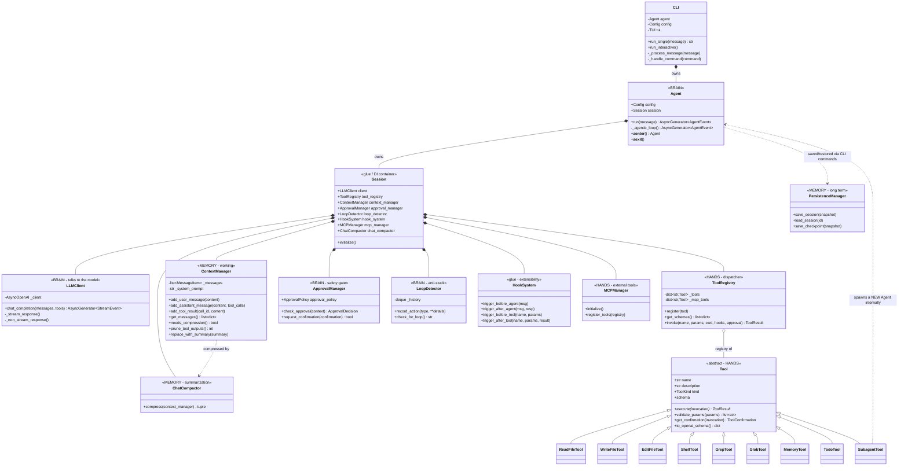
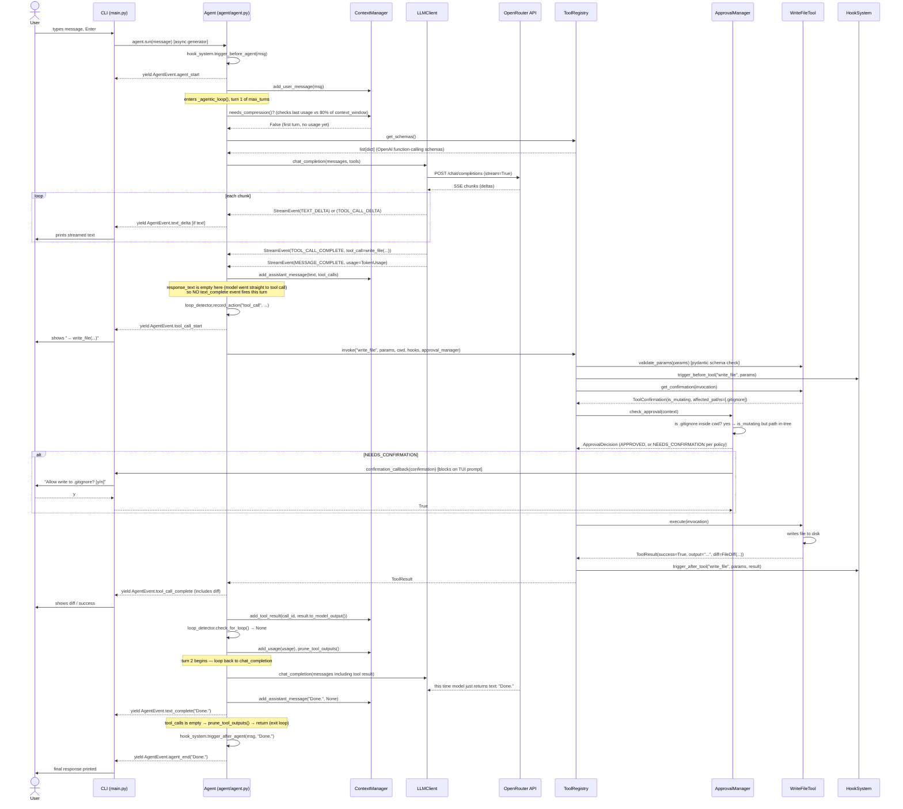

# Codebase Teardown: `ai-coding-agent`

> Read this once, slowly, with the code open next to it. Skimming this document without opening the files will not build a mental model — it'll just give you vocabulary.

---

## 0. Before anything else: a live problem in this repo

`client/llm_client.py:26` has a **real OpenRouter API key hardcoded in a comment**, and it's baked into your git history across all 3 commits on the public repo `github.com/RivaanRanawat/ai-coding-agent`. This isn't a teardown finding, it's an incident. Rotate the key at OpenRouter now, then scrub history with `git filter-repo` (a new commit does NOT remove it — anyone can `git log -p` and find it, which is exactly how I found it). Do this before you do anything else in this document.

---

## 1. System Overview

**What it does, end to end, no jargon:** You type a request in a terminal. The agent stuffs your message plus a big system prompt (identity, environment, tool list, safety rules) into a list of chat messages and sends it to an LLM (via OpenRouter, using the OpenAI SDK's chat-completions format). The LLM streams back either plain text or a request to call a tool (read a file, run a shell command, search code, etc.). If it's a tool call, the agent runs that tool locally, appends the result to the message list, and sends the whole thing back to the LLM — repeat until the LLM stops asking for tools and just returns text. That's the whole product. Everything else (safety approval, context compaction, loop detection, hooks, MCP, subagents) is scaffolding around this one repeating exchange.

**Core architecture pattern:** This is a **ReAct-style agentic loop** (Reason → Act → Observe, repeated), not a planner-executor and not a state machine with explicit states. There's no separate "planning phase" object — planning is just something the LLM is instructed to do in the system prompt (see `prompts/system.py`'s "Primary Workflows" section). Control flow is a single `for turn_num in range(max_turns)` loop in `agent/agent.py`. It's also **event-driven at the presentation layer**: the loop yields `AgentEvent` objects that the CLI/TUI consumes to render streaming text and tool-call visualizations, decoupling "what the agent does" from "how it's displayed."

**Core components (8), one line each:**

| Component | File | Responsibility |
|---|---|---|
| `Agent` | `agent/agent.py` | Owns the turn loop: call LLM → get tool calls → execute tools → feed results back → repeat |
| `Session` | `agent/session.py` | Wires together everything a running agent needs (client, registry, context, hooks, approval, MCP) — a dependency container |
| `ContextManager` | `context/manager.py` | Owns the message history array, formats it for the API, decides when it's too big |
| `ToolRegistry` | `tools/registry.py` | Holds all tools, validates params, runs the approval gate, invokes the tool, catches exceptions |
| `LLMClient` | `client/llm_client.py` | Thin wrapper over `AsyncOpenAI` — turns raw SSE stream chunks into typed `StreamEvent`s |
| `ApprovalManager` | `safety/approval.py` | Decides APPROVE / REJECT / ASK-THE-HUMAN for a mutating tool call, based on policy + regex danger patterns |
| `LoopDetector` | `context/loop_detector.py` | Keeps a ring buffer of recent action signatures, detects exact repeats and short cycles |
| `HookSystem` | `hooks/hook_system.py` | Fires user-defined shell scripts at lifecycle points (before/after agent run, before/after tool call) |

**Brain vs. hands vs. memory** (see diagram below for the full mapping):
- **Brain (orchestration):** `Agent._agentic_loop`, `LLMClient` (talks to the actual reasoning engine), `LoopDetector`, `ApprovalManager`
- **Hands (execution):** `ToolRegistry`, every class under `tools/builtin/`, `tools/mcp/`, `tools/subagents.py`
- **Memory (state):** `ContextManager` (working memory / conversation), `agent/persistence.py` (long-term / cross-session), `tools/builtin/memory.py` (user-fact memory injected into the system prompt)

---

## 2. Class / Component Diagram



**Key relationship to notice:** `SubagentTool.execute()` (`tools/subagents.py:43`) imports and instantiates a brand-new `Agent` inside a tool call. This makes the architecture **recursive**: a tool call can spin up an entire second agentic loop with its own restricted tool registry and turn budget. This is elegant and also the first thing that will bite you in debugging (see §6).

---

## 3. Request Flow — Tracing One Real Request

Scenario: interactive mode, user types `"add a .gitignore entry for *.log"`, and the LLM decides to call `write_file`.



**Where the LLM is actually called:** exactly once per turn, inside `Agent._agentic_loop` at `agent/agent.py:60` (`self.session.client.chat_completion(...)`). A "turn" ends either when the model returns pure text (no tool calls) or when `max_turns` (default 100) is hit. So for a request needing 3 tool calls before a final answer, that's 4 LLM calls total: 3 that each produce one round of tool call(s), 1 that produces the final text. Note: **all tool calls the model returns in a single turn's response are executed sequentially in a `for tool_call in tool_calls` loop** (`agent/agent.py:114`) — not concurrently, and not parallel API calls to different tools. This is a real limitation worth noting: even though the LLM can emit N tool calls in one response, they are run one at a time and awaited in order.

**What happens if a tool call fails mid-flow:** It does NOT crash the loop. `ToolRegistry.invoke()` wraps `tool.execute()` in a try/except (`tools/registry.py:131`) and converts any exception into a `ToolResult.error_result(...)`. That error result is still appended to context via `add_tool_result` with `is_error=True`, formatted as `"Error: {error}\n\nOutput:\n{output}"` (`tools/base.py:88`). The loop continues — the LLM sees the error message on the next turn and is expected to self-correct (per the "Error Recovery" section baked into the system prompt). The only way a tool failure kills the whole request is if the *LLM API call itself* fails after retries (handled separately, see below), or if `max_turns` is exhausted first.

**Retry logic:** Only the LLM call has retries — `LLMClient.chat_completion` retries up to 3 times with exponential backoff (`2**attempt` seconds) on `RateLimitError` and `APIConnectionError` (`client/llm_client.py:73-107`). A generic `APIError` is NOT retried — fails immediately. Tool execution has zero retry logic; one failure, one error message back to the model, and it's the model's job to decide whether to retry.

---

## 4. Reading Order

Read these in this order. Each unlocks understanding of the next; don't jump ahead.

1. **`README.md`** — 2 minutes. Just get the feature list in your head as a checklist of "things I should expect to find code for."

2. **`config/config.py`** — Understand `Config` first because *every* other class takes it in `__init__`. It's the one object threaded through the whole system. Look for: `ApprovalPolicy` enum (5 values, this drives a lot of branching later), `ModelConfig`, the `api_key`/`base_url` properties reading from env vars. Don't worry about: `ShellEnvironmentPolicy`, `HookConfig`, `MCPServerConfig` — you'll come back to these.

3. **`main.py`** — This is the actual entry point (`click` CLI, `main()` at the bottom just calls itself — note it's called unconditionally at module level, not behind `if __name__ == "__main__"`, which is a code smell but harmless here). Look for: `CLI.run_single` vs `CLI.run_interactive`, and how `_process_message` consumes `agent.run()` as an async generator. Don't worry about: the `_handle_command` slash-command branches yet — that's UI plumbing, skim it.

4. **`agent/agent.py`** — The heart of the system. Read this twice. First pass: just follow `_agentic_loop`'s control flow top to bottom, ignore what each collaborator does internally. Second pass: note every place it delegates (`context_manager`, `tool_registry`, `loop_detector`, `hook_system`) — these are your next reading targets, in the order they appear in the loop.

5. **`agent/session.py`** — Now that you've seen `self.session.X` used everywhere in `agent.py`, read `Session.__init__` to see exactly what gets constructed and in what order. This is a dependency-injection container with no framework — just a constructor. Notice `context_manager` is `None` until `initialize()` runs (async init pattern — necessary because tool discovery/MCP connection is async but `__init__` can't be).

6. **`client/response.py` then `client/llm_client.py`** — Read `response.py` first (it's just dataclasses — `StreamEvent`, `TokenUsage`, `ToolCall`) so the shapes make sense before you see them constructed. Then `llm_client.py`: focus on `_stream_response`, specifically how tool-call *deltas* (`tool_call_delta.function.arguments` arriving in fragments across chunks) get buffered by `idx` into a dict and only turned into a complete `ToolCall` at stream end. This buffering-by-index trick is the single most "you'll get this wrong the first time you build it yourself" piece of the whole codebase.

7. **`tools/base.py`** — The `Tool` abstract base class and `ToolResult`/`ToolInvocation`/`ToolConfirmation` dataclasses. This is the contract every tool honors. Look for: how `to_openai_schema()` converts a Pydantic model into an OpenAI function-calling JSON schema — that's the bridge between Python types and what the LLM actually sees.

8. **`tools/registry.py`** — `ToolRegistry.invoke()` is the single choke point every tool call passes through: validate → before-hook → confirmation → approval → execute → after-hook. Read it as a pipeline, not a class.

9. **One concrete tool: `tools/builtin/shell.py`** — Pick this one specifically because it touches almost every cross-cutting concern (blocked commands, timeout via `asyncio.wait_for`, env var scrubbing, subprocess management). Once you understand this tool, `read_file.py`/`write_file.py`/`edit_file.py` are trivial by comparison — skim them.

10. **`context/manager.py`** — `ContextManager` is just a list of `MessageItem` plus bookkeeping. Focus on `needs_compression()` (the 80%-of-context-window trigger), `prune_tool_outputs()` (the *other* context-shrinking mechanism, separate from compaction — don't conflate them), and `replace_with_summary()` (what happens after compaction runs).

11. **`context/compaction.py`** and **`prompts/system.py`'s `get_compression_prompt()`** together — this is "ask the LLM to summarize itself" as a context management strategy. Notice it's a *second, separate* LLM call outside the main loop.

12. **`context/loop_detector.py`** — Small, self-contained, read in 5 minutes. Signature-based repeat detection + cycle detection over a 20-item ring buffer.

13. **`safety/approval.py`** — `ApprovalManager.check_approval()` and the two regex lists (`DANGEROUS_PATTERNS`, `SAFE_PATTERNS`). Understand the decision tree: is_mutating → command safety check → path-in-cwd check → dangerous flag check. This is NOT a sandbox — it's a heuristic gate. Know the difference.

14. **`tools/subagents.py`** — Now that you understand `Agent`, this file will click immediately: it's `Agent` used recursively as a tool. This is where "hands" and "brain" blur — a tool *is* another brain.

15. **Everything else** (`hooks/hook_system.py`, `tools/mcp/*`, `agent/persistence.py`, `ui/tui.py`, `tools/discovery.py`) — read on demand. These are all "glue that extends the core loop" and none of them change your mental model of how the agent fundamentally works. `ui/tui.py` is 620 lines of Rich console formatting — genuinely skip it unless you're debugging rendering.

**What NOT to worry about at all on a first pass:** `utils/paths.py`, `utils/text.py`, `utils/errors.py`, `apply_patch.py` (a large, separate multi-file-patch parser — it's a self-contained algorithm, orthogonal to the agent loop), `.ai-agent/tools/test_tool.py` and `scripts/test_tool.py` (test scaffolding/examples for the dynamic tool-discovery mechanism).

---

## 5. How to Read Unfamiliar Code (the transferable skill)

**Orienting in <30 minutes, no docs:**

1. **Find the entry point before anything else.** Look for `if __name__ == "__main__"`, a `main.py`/`cli.py`/`index.js`, or a `pyproject.toml`/`package.json` `scripts`/`entry_points` section. In this repo, `main.py`'s bottom-of-file `main()` call is the giveaway even though it's missing the `__main__` guard.
2. **Find the one object that gets passed to everything.** In config-driven systems there's almost always a `Config`/`Settings`/`Context` object threaded through every constructor. Grep for the most common constructor parameter name across files (`grep -rn "def __init__" | grep config`). That object tells you what's *configurable*, which tells you what the system considers its own knobs vs. hardcoded behavior.
3. **Find the loop.** Any agent, server, or event system has exactly one `while True` or `for ... in range(...)` that's the actual runtime. Grep for `while True`, `async for`, `for.*in range`. Here it's `agent/agent.py:40`.
4. **Read the loop body top to bottom without chasing every call.** Get the shape first: what gets checked, what gets called, what gets appended, what makes it exit. Only after you have the shape do you drop into each collaborator.
5. **Grep for the framework's "verb" vocabulary.** In an agent system: `tool`, `call`, `invoke`, `execute`, `message`, `context`. The nouns these attach to (`ToolCall`, `ToolResult`, `MessageItem`) are your core data model — write them down.

**Finding the entry point with zero docs:** package manifest first (`pyproject.toml` → `[project.scripts]`, `package.json` → `"main"`/`"bin"`), then `main.py`/`app.py`/`server.py`/`index.ts` by filename convention, then `grep -rn "if __name__"` as a last resort. If it's a web service, the entry point is wherever the HTTP framework's `app = Flask(...)`/`FastAPI()`/`express()` gets instantiated — trace from there.

**Core logic vs. glue vs. config:**
- **Core logic** = code that, if deleted, changes *what the system fundamentally does*. Delete `agent/agent.py`'s loop and you have no agent. Test: "does the one-paragraph description of the system still hold true without this file?"
- **Glue code** = code that connects core logic to the outside world but contains no decisions of its own — it just plumbs data from A's shape to B's shape. `agent/session.py` is 90% glue: it constructs things and hands them to each other. `ui/tui.py` is glue: it takes events and calls Rich console methods, no agent logic in it.
- **Config** = anything that's a knob, not a behavior. If a value could plausibly move to an env var, TOML file, or CLI flag without changing the *shape* of the code around it, it's config. `DANGEROUS_PATTERNS` in `safety/approval.py` is borderline — it looks like config (a list of strings) but functions as core safety logic since it's not user-overridable. That's worth flagging as a design smell, not just noting.

The fast filter: **core logic makes decisions (`if`/branching on domain state), glue code moves data, config is inert data with no control flow attached.**

---

## 6. Debugging Method

**What to instrument first, always, in this order:**

1. **The event stream itself.** Since `Agent.run()` and `_agentic_loop()` are async generators yielding typed `AgentEvent`s, the cheapest, highest-signal debug step is to log every event's `type` and a truncated `data` before it reaches the CLI. This gives you a timeline of exactly what the agent decided to do, in order, for free — no new instrumentation needed, you're just tapping an existing seam.
2. **The exact message list sent to the LLM** on each turn (`self.session.context_manager.get_messages()` right before `chat_completion` is called). 90% of "the agent is behaving weirdly" bugs are actually "the agent is looking at different context than you think it is" — pruning, compaction, or a malformed tool result silently mutated what the model sees.
3. **Raw tool call arguments before `parse_tool_call_arguments`.** If a tool call's arguments arrive malformed JSON (common with weaker/free models), `parse_tool_call_arguments` (`client/response.py:81`) silently falls back to `{"raw_arguments": arguments_str}` — which then fails `validate_params` downstream with a confusing pydantic error instead of a clear "the model emitted broken JSON" error. Log the raw string before parsing.

**Three realistic agent-specific bugs and how to isolate each:**

**Bug A — Infinite/near-infinite tool-call loop.**
Symptom: agent burns through many turns calling the same or similar tool repeatedly, `max_turns` eventually fires.
Isolation: `LoopDetector.check_for_loop()` should catch exact repeats within 3 calls and cycles up to length 3 — first check whether it's even firing (log its return value every turn). If it's not firing, the loop is probably *not* exact-repeat (e.g., the model calls `read_file` on a slightly different path each time, defeating the exact-signature match in `record_action`). If it *is* firing, check whether `create_loop_breaker_prompt`'s injected user message actually reaches the model — verify it's not immediately compacted away or pruned before the next `chat_completion` call. Root cause is almost always one of: (a) a tool returning an error the model can't interpret so it keeps retrying variations, or (b) a tool succeeding but returning output the model doesn't recognize as sufficient (e.g., empty grep results formatted ambiguously).

**Bug B — Context window overflow / truncated context.**
Symptom: API errors about token limits, or the model "forgets" things from early in the conversation.
Isolation: check `ContextManager.needs_compression()`'s math — it compares `self._latest_usage.total_tokens` (usage from the *previous* API response) against `context_limit * 0.8`. This is reactive, not predictive: it only compresses *after* you've already gotten a response that used that many tokens, meaning the request that pushed you over 80% already succeeded, and you find out about the overflow risk one turn late. If the model's next single turn adds a huge tool result (e.g., a `read_file` on a massive file) that alone exceeds the remaining headroom, you can blow through 100% between compression checks. Also check `prune_tool_outputs()` separately — it's a *different* mechanism (clears old tool result content, doesn't summarize) that runs every turn regardless of compression state, protecting the most recent 40k tokens (`PRUNE_PROTECT_TOKENS`) of tool output and only pruning if it'd free at least 20k (`PRUNE_MINIMUM_TOKENS`). If context still overflows, check whether a single tool result is bigger than `PRUNE_PROTECT_TOKENS` itself — pruning won't touch it because pruning only prunes what's *outside* the protected window, and if a single message is 100k tokens, no combination of pruning fixes that.

**Bug C — Malformed tool schema / model calls a tool with wrong argument shape.**
Symptom: tool call fails validation (`Invalid parameters: ...`) repeatedly, or a tool receives arguments that don't match its Pydantic schema.
Isolation: dump `tool.to_openai_schema()` for the specific tool and manually check it against what the model actually sent (`tool_call.arguments`, pre-validation). Common root causes: (a) `model_json_schema(schema, mode="serialization")` in `tools/base.py:168` drops or reshapes fields Pydantic doesn't serialize simply (nested unions, `Path` types) — the schema shown to the model doesn't match what your code expects; (b) a weaker/free model (this repo defaults to `mistralai/devstral-2512:free` — note the free-tier model, which matters for reliability) simply hallucinates a plausible-but-wrong argument name. Fix for (a) is inspecting the actual generated JSON schema, not the Pydantic model. Fix for (b) is tightening `description` fields on schema params — models lean on descriptions more than field names.

---

## 7. "Build Your Own" Bridge

**Minimal version, <300 lines, to internalize the pattern:**

```
loop.py           (~60 lines)  — the turn loop: call LLM, get tool_calls or text, execute, repeat
llm.py            (~40 lines)  — wrap one provider's streaming chat API, yield text/tool_call events
tools.py          (~60 lines)  — Tool base class + 3 real tools (read_file, write_file, shell)
context.py        (~30 lines)  — list of messages, append methods, to_api_format()
main.py           (~30 lines)  — CLI: read stdin, run the loop, print output
```

Skip entirely for a learning build: approval/safety system, hooks, MCP, subagents, loop detection, compaction, persistence, TUI streaming rendering. None of them teach you anything about the *core pattern* — they're all "now productionize it" concerns. Build the 220-line version first, get it working end-to-end with real tool calls against a real file, *then* add one of those concerns at a time so you feel exactly what problem each one solves. Loop detection in particular will feel pointless until you watch your own toy agent get stuck calling `read_file` on the same path 40 times — build it, watch it break, then add the fix. That's the fastest way to actually understand why the mechanism exists instead of cargo-culting it in from day one.

**The 3 hardest parts to get right (and where this repo's version sits on each):**

1. **Streaming tool-call argument assembly.** The LLM API streams tool call arguments as string *fragments* across many chunks, indexed by position (`tool_call_delta.index`), not as one atomic JSON blob. You must buffer by index and only parse JSON once the stream signals completion. Get this wrong and you'll intermittently get `JSONDecodeError`s that seem random but are actually a race between "chunk arrived" and "you tried to parse too early." This repo does it correctly (`client/llm_client.py:118-178`) — study that buffering dict pattern directly, it's a clean reference implementation.

2. **Context lifecycle management (growth vs. relevance vs. cost).** It's not one problem, it's three fighting each other: the conversation needs to grow (new turns), but every token costs money and eventually hits a hard ceiling, and not all old content is equally useless (a completed action's *conclusion* matters more than its raw tool output). This repo's answer is two independent mechanisms (reactive summarization + sliding-window pruning) that don't talk to each other and can both fire in ways that surprise you (see Bug B above). When you build your own, at minimum decide up front: do you prune (delete), summarize (compress via LLM call), or both — and if both, in what order and with what triggers, explicitly, on paper, before you code it. Don't let it emerge accidentally the way it seems to have here.

3. **Failure containment without losing agency.** A tool failing should never crash the loop, but it also can't be silently swallowed — the model needs to *see* the failure in a form it can reason about and recover from. The subtlety is in `ToolResult.to_model_output()` (`tools/base.py:84`): the exact string format you feed back to the model after an error meaningfully affects whether it retries sensibly or spirals. Getting the granularity right (full stack trace vs. one-line summary vs. structured error object) is genuinely hard to tune and this repo's answer — `f"Error: {error}\n\nOutput:\n{output}"` — is a reasonable, simple default but not obviously optimal; you'll want to experiment with this when you build your own.

---

## 8. Direct Assessment: What's Overengineered vs. Essential

**Essential, keep if you build your own:**
- The turn loop itself (`_agentic_loop`) — irreducible core.
- Streaming event abstraction (`StreamEvent`/`AgentEvent`) — decoupling model-talk from UI-talk is worth the indirection even at small scale.
- `Tool` ABC + Pydantic schema → OpenAI schema conversion — this pattern (one source of truth for both validation and the LLM-facing schema) is genuinely good design, copy it.
- Basic approval gating for mutating operations — non-negotiable for anything that touches a real filesystem or shell.

**Justified complexity, but know why before you add it:**
- Loop detection — cheap, small, catches a real failure mode. Worth the ~50 lines.
- Context pruning/compaction — necessary at scale, but as noted, this repo's *two separate uncoordinated mechanisms* is a design smell you shouldn't copy verbatim. If you build this, make it one coordinated system with a single trigger and a single strategy decision, not two independently-firing heuristics.

**Overengineered relative to what it buys you, be honest about this:**
- **The recursive subagent-as-tool pattern** (`tools/subagents.py`) is clever but fragile: it constructs a *whole new* `Config`, `Agent`, and `Session` per subagent call, with its own deadline-polling loop reimplemented ad hoc (`asyncio.get_event_loop().time() > deadline` checked per-event instead of using `asyncio.wait_for`). It works, but it's more machinery than the two hardcoded subagent definitions (`CODEBASE_INVESTIGATOR`, `CODE_REVIEWER`) currently justify. If you're building your own and don't have a concrete multi-agent need yet, skip this until you do.
- **Hooks system** (`hooks/hook_system.py`) shells out to arbitrary user scripts at 5 lifecycle points, with its own timeout/env-var/tempfile machinery. This is real infrastructure for a feature that, per the config (`hooks_enabled: bool = False` — off by default), the author themselves clearly wasn't relying on day-to-day. Fine to have, but recognize it as "nice-to-have extensibility surface," not core to the agent pattern.
- **MCP integration** — valuable in the ecosystem sense (interop with the growing MCP tool ecosystem) but adds a whole second tool-registration pathway (`_mcp_tools` dict, separate from `_tools`) for what is conceptually the same concept (a callable tool with a schema). If you're learning the pattern, treat MCP as "swap in a network-backed Tool implementation later," not something to build from scratch on day one.
- **Session save/resume/checkpoint** (`agent/persistence.py`, the `/save` `/resume` `/checkpoint` `/restore` commands in `main.py`) — reasonable feature, but note the `/resume` and `/restore` code paths in `main.py` are near-identical copy-pasted blocks (~35 lines duplicated almost verbatim at `main.py:208-249` and `main.py:262-303`, including a leftover bug: `/restore`'s success message references an undefined `checkpoint_id` variable at `main.py:302` — that will crash with a `NameError` if you actually hit that code path with `/restore`). Not overengineered so much as unfinished — flagging it because "learn the pattern, not the polish" cuts both ways: don't copy this duplication either.

**Bottom line:** the core loop and tool-execution pipeline are well-built and worth studying closely. Everything past that — hooks, MCP, subagents, persistence — is optional surface area bolted onto a good core. Build the core first. Add the rest only when a real need forces it, not because this repo has it.
